# Macro Flutter App — System Architecture Graph

```mermaid
graph TD
    subgraph UI_Layer["📱 UI & Navigation Layer"]
        App["MacroApp (main.dart)"]
        Nav["ResponsiveNavigation & SidebarNavigation"]
        
        subgraph Auth_Screens["Auth Screens"]
            Login["LoginScreen"]
            Signup["SignupScreen"]
            Forgot["ForgotPasswordScreen"]
        end
        
        subgraph Workspace_Views["Workspace Feature Views"]
            Dash["DashboardView"]
            Inbox["InboxView & EmailDetailScreen"]
            Chat["ChatView & MobileChatScreen"]
            Docs["DocsView"]
            Tasks["TasksView"]
            CRM["CrmView"]
            Memory["AiMemoryView"]
            Calls["CallRoomView"]
            Profile["ProfileScreen"]
        end
        
        Copilot["AiCopilotDrawer"]
    end

    subgraph State_Controllers["⚙️ State Management & Controllers"]
        WP["WorkspaceProvider"]
        CC["ChatController"]
        IC["InboxController"]
        AIC["AiChatController"]
        GS["GoogleService"]
    end

    subgraph Repository_Layer["🔌 Repository Infrastructure"]
        AuthRepo["AuthRepository / AuthRepositoryImpl"]
        ChatRepo["MacroChatRepository"]
        InboxRepo["MacroInboxRepository"]
        AgentRepo["MacroAgentRepository"]
        DocsRepo["MacroDocsRepository"]
        TasksRepo["MacroTasksRepository"]
        CrmRepo["MacroCrmRepository"]
        CallsRepo["MacroCallsRepository"]
    end

    subgraph Networking_Cache["🌐 Networking & Storage Core"]
        Config["MacroServiceConfig (prod / localDev)"]
        Realtime["MacroRealtimeClient (wss://connection-gateway.macro.com)"]
        Storage["SecureKeyValueStore / SecureStorageService"]
        Cache["LocalCacheStore / InMemoryLocalCacheStore"]
    end

    subgraph Backend_Services["☁️ Macro Upstream Backends"]
        AuthService["auth-service.macro.com"]
        StorageService["cloud-storage.macro.com"]
        EmailService["email-service.macro.com"]
        CognitionService["document-cognition.macro.com"]
        GatewayService["connection-gateway.macro.com"]
    end

    %% UI Connections
    App --> Auth_Screens
    App --> Nav
    Nav --> Workspace_Views
    Workspace_Views --> Copilot

    %% UI to Controllers & Repositories
    Login --> AuthRepo
    Login --> GS
    Signup --> AuthRepo
    Signup --> GS
    Profile --> GS
    Profile --> AuthRepo
    
    Inbox --> IC
    Chat --> CC
    Copilot --> AIC
    Docs --> DocsRepo
    Tasks --> TasksRepo
    CRM --> CrmRepo
    Memory --> AgentRepo
    Calls --> CallsRepo

    %% Controller to Repository & Realtime Dependencies
    IC --> InboxRepo
    IC --> Cache
    CC --> ChatRepo
    CC --> Cache
    CC --> Realtime
    AIC --> AgentRepo
    GS --> Config

    %% Repositories to Network & Storage Core
    AuthRepo --> Storage
    AuthRepo --> Config
    ChatRepo --> Config
    InboxRepo --> Config
    AgentRepo --> Config
    DocsRepo --> Config
    TasksRepo --> Config
    CrmRepo --> Config
    CallsRepo --> Config
    Realtime --> Config

    %% Core to Upstream Endpoints
    AuthRepo -- "POST /login/sso & GET /user/me" --> AuthService
    GS -- "POST /login/sso & GET /link/gmail/status" --> AuthService
    InboxRepo -- "GET /email/threads/previews/cursor/inbox" --> EmailService
    GS -- "GET /email/calendar/events" --> EmailService
    ChatRepo -- "GET /storageHost/comms/channels" --> StorageService
    AgentRepo -- "POST /stream/chat/message" --> CognitionService
    Realtime -- "wss://token={jwt}" --> GatewayService
```

---

## 🏗️ Architectural Flow Map

### 1. **Authentication & SSO Flow**:
- **Mobile SSO Entry**: `GoogleService.initiateGoogleSso()` triggers `POST authHost/login/sso` with `{"provider": "google_gmail", "client_type": "mobile"}`.
- **Fail-Closed Validation**: `AuthRepositoryImpl._validateTokenWithServer()` hits `GET authHost/user/me`. Rejects invalid tokens immediately without fallback.
- **Offline / Local Dev Fallback**: `AuthRepositoryImpl` supports `MacroServiceConfig.localDevelopment()` for offline dev testing.

### 2. **Gmail & Calendar Connection**:
- **Link Status Polling**: `GoogleService.checkConnectionStatus()` hits `GET authHost/link/gmail/status`.
- **Live Status Render**: `ProfileScreen` renders live state badges (`Not connected`, `Linking...`, `Connected`, `Needs Reauth`).
- **Calendar Sync**: `GoogleService.fetchCalendarEvents()` hits `GET emailHost/email/calendar/events`.

### 3. **Realtime Channels & Messaging**:
- **WebSocket Gateway**: `MacroRealtimeClient` connects to `wss://connection-gateway.macro.com?token={jwt}` with 25s ping/pong heartbeats and exponential backoff.
- **Channels Repo**: `MacroChatRepository` fetches real channels via `GET storageHost/comms/channels` and channel messages via `GET storageHost/channels/{id}/messages`.

### 4. **AI Copilot & Cognition**:
- **Streamed Copilot**: `AiChatController` calls `MacroAgentRepository.streamChatMessage()` hitting `POST cognitionHost/stream/chat/message` and `GET cognitionHost/memory`.
